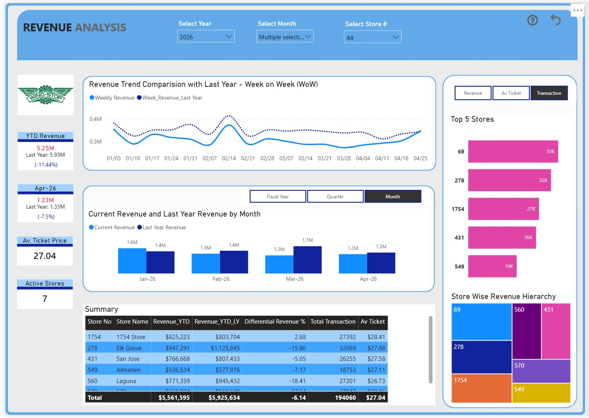

# My Code Tricks

[Home](index.md) | [Projects](projects.md) | [Contact](contact.md)

# 💼 Projects

Welcome to my project portfolio. Each project highlights a real business problem, the solution implemented, and the measurable impact delivered.

---

## 🤖 Automated Invoice Processing

  

### Business Challenge

The client manually downloaded invoices from Paycom, processed them, and uploaded them back into the system. The process took approximately **2–3 hours** every day.

### Solution

Designed an end-to-end automation workflow that:

* Downloaded invoices automatically
* Processed the required files
* Uploaded invoices back into the business system
* Generated status reports

### Business Impact

| Metric         | Result                        |
| -------------- | ----------------------------- |
| Time Required  | **2–3 Hours → 15–20 Minutes** |
| Manual Work    | Reduced by over 90%           |
| Accuracy       | Improved                      |
| Business Value | Faster invoice processing     |

### 📷 Screenshots

| Dashboard                                | Workflow                                |
| ---------------------------------------- | --------------------------------------- |
|  |  |

### 🎥 Video Demonstration

---

## 📊 PRC Cost Analysis Dashboard

  

### Business Challenge

The client required detailed visibility into operational costs for better financial decision-making.

### Solution

Developed an executive dashboard featuring:

* Cost Analysis
* KPI Monitoring
* Trend Analysis
* Interactive Filtering

### Business Impact

✅ Faster reporting

✅ Better decision-making

✅ Improved visibility into operational costs

### 📺 Watch Demo

[▶ Watch on YouTube](https://youtu.be/7-kdOuMUP1M)

---

## 📄 Intelligent PDF Processing

  

### Business Challenge

Employees manually opened PDF documents, extracted information, renamed files, and organized folders.

### Business Impact

| Before    | After      |
| --------- | ---------- |
| 2–3 Hours | 15 Minutes |

### 🎥 Demo

[Watch Project Video](https://www.youtube.com/watch?v=YOUR_VIDEO_ID)

---

## 📈 Executive Revenue Dashboard

  

### Highlights

* Executive KPIs
* Revenue Trends
* Sales Performance
* Interactive Filters

### 📺 Demo
<a href="https://youtu.be/xYpaMtdytAg" target="_blank">
    ▶ Watch Demo
</a>
